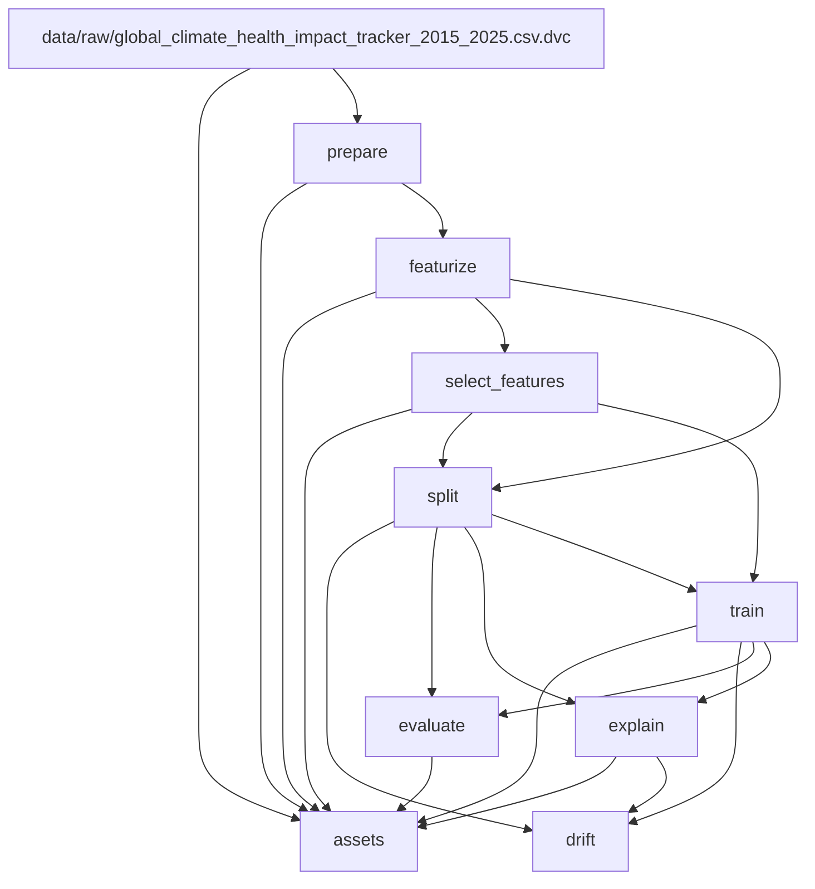
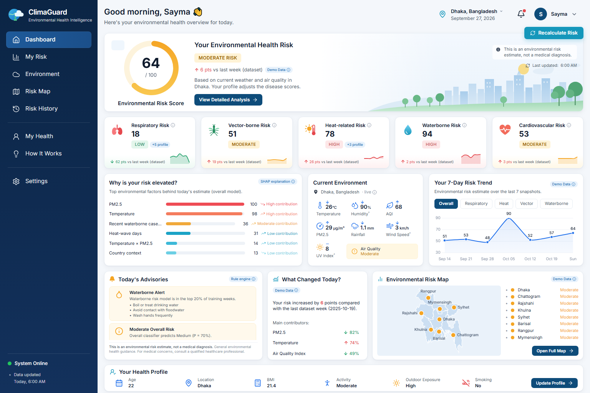
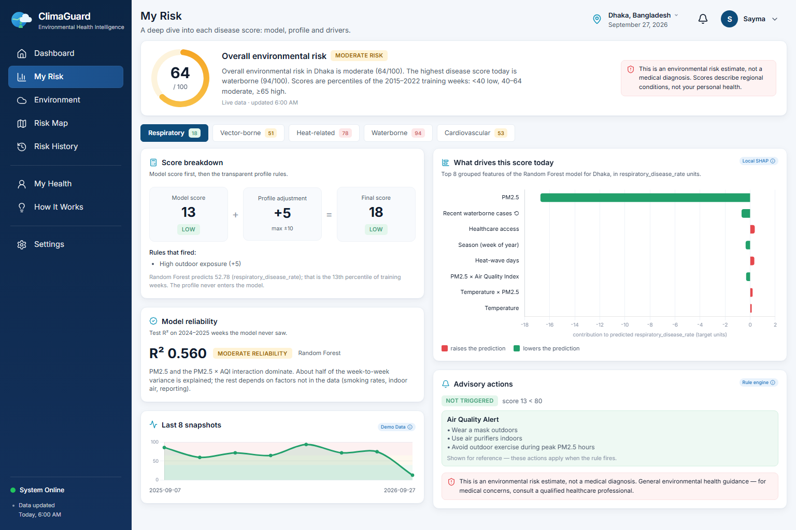
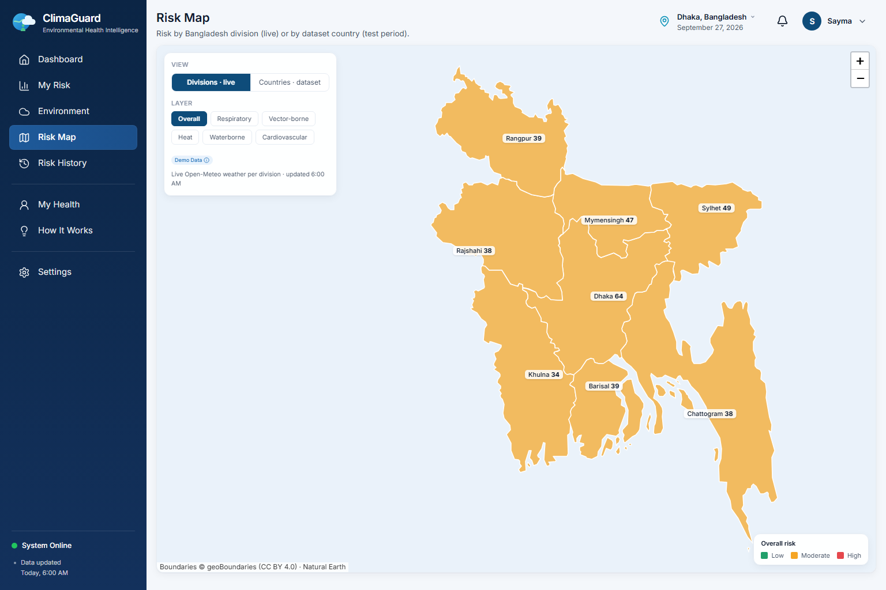
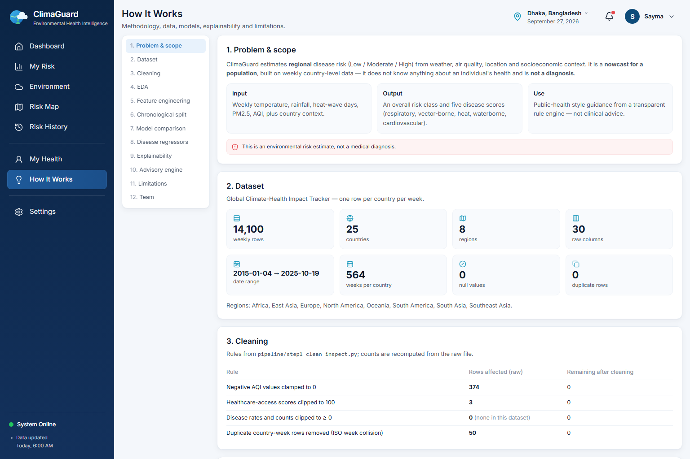
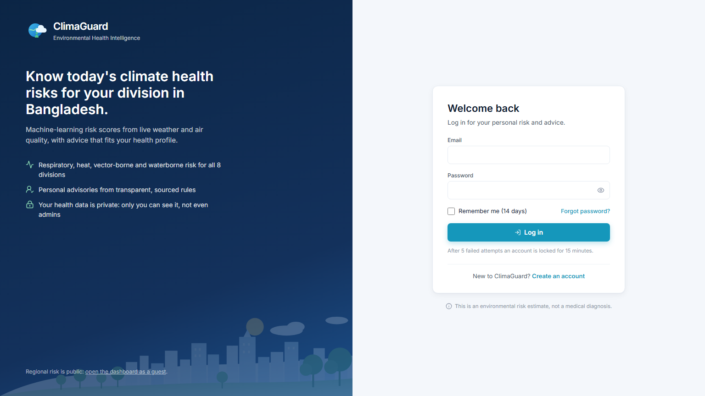
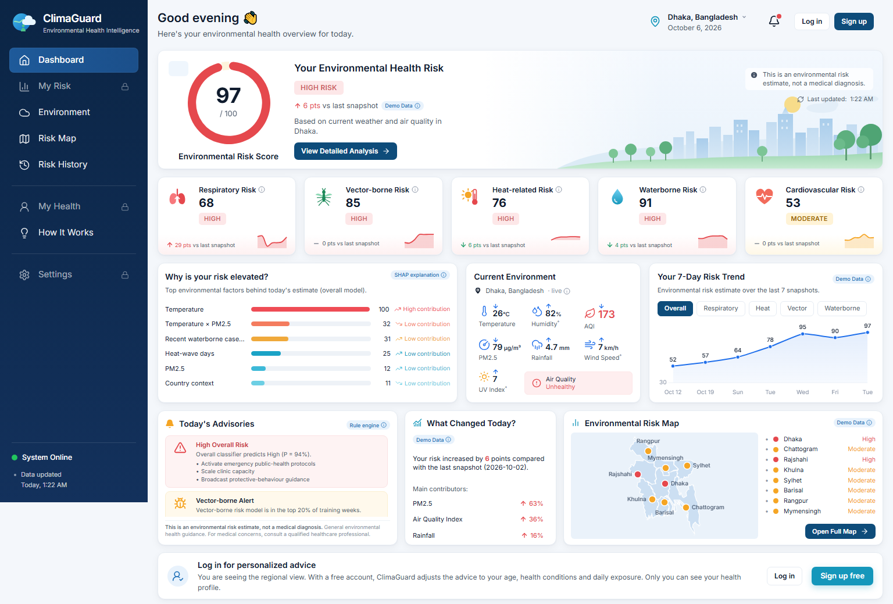
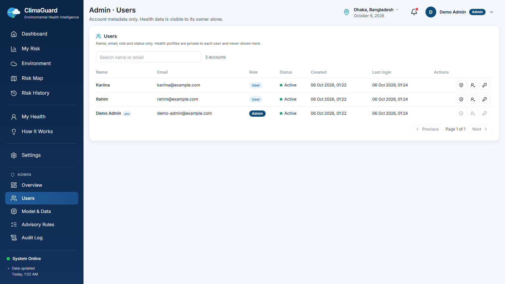
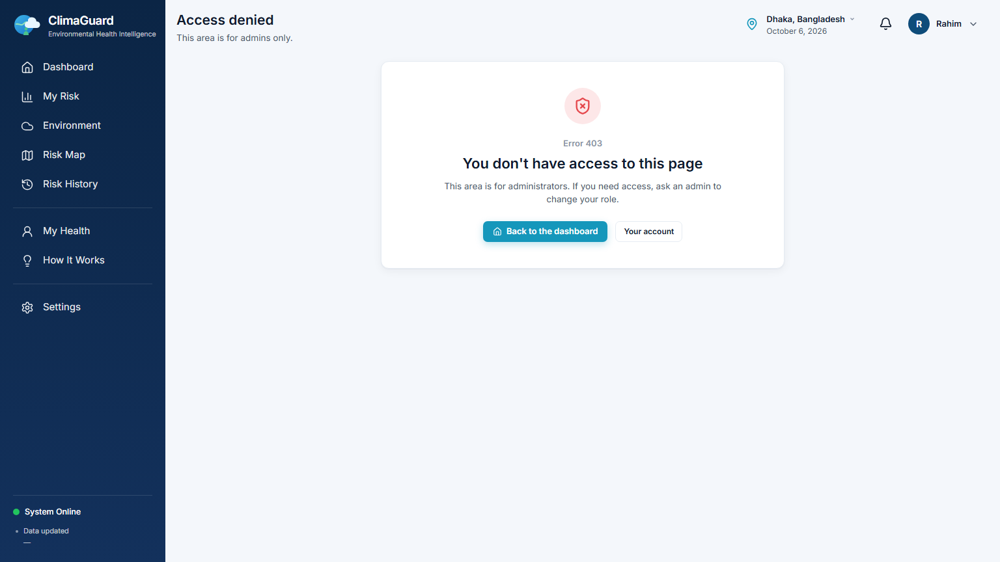

# ClimaGuard — Regional Environmental Disease-Risk Nowcast

ClimaGuard estimates weekly **regional** disease risk from climate, air-quality and
socioeconomic data for 25 countries (2015–2025). One classifier predicts an overall
Low / Medium / High risk class, and five regressors predict respiratory, vector-borne,
heat-related, waterborne and cardiovascular indicators. SHAP explains every
prediction, a rule engine turns them into public-health advisories, and a Flask
dashboard shows the results for Bangladesh with live Open-Meteo weather.
The whole ML workflow is a reproducible **DVC pipeline**:
`git clone` → `dvc pull` → `dvc repro` gives the same data, models and metrics.

> ⚠️ **Disclaimer.** This is a *regional environmental risk nowcast* for a population,
> built from country-level weekly data. It is **not a medical diagnosis** and must not
> be used for individual health decisions.

---

## 1. Problem & dataset

**Problem.** Climate and pollution drive several disease burdens with a lag (heat
→ admissions within days; rain + warmth → mosquitoes within weeks). Given a
country-week of environmental data, estimate how elevated each disease indicator is.

**Dataset.** `global_climate_health_impact_tracker_2015_2025.csv`
(Global Climate-Health Impact Tracker), tracked with DVC under `data/raw/`.

| Property | Value |
|---|---|
| Rows × columns | 14,100 × 30 |
| Countries / regions | 25 countries, 6 regions |
| Granularity | weekly, 564 weeks per country, 2015-01-04 → 2025-10-19 |
| Features | temperature, anomaly, precipitation, heat-wave days, drought/flood flags, extreme events, PM2.5, AQI, population, GDP, healthcare access, food security, mental-health index |
| Targets | respiratory rate, cardio mortality, vector-borne risk score, waterborne incidents, heat admissions |
| Nulls | 0 |

**Cleaning** (`prepare` stage, counts in `reports/metrics/data_quality.json`):
- 374 negative AQI values → 0.
- Healthcare access clipped to ≤ 100 (3 rows).
- Disease rates and counts, PM2.5 and precipitation clipped to ≥ 0 (none were negative).
- Drought/flood flags forced to 0/1.
- 50 duplicate country-week rows dropped (ISO week numbers repeat at some year boundaries): 14,100 → 14,050 rows.
- Rows sorted by country and date before any lag or rolling window.

**Known gaps:**
- There is no humidity, wind, UV, elevation, smoking/BMI or confirmed case count data.
- The temperature column is on the dataset's own scale, not real °C.
- The data is country-level and weekly, so there is nothing below national level or finer than a week.

More detail: [`data_card.md`](data_card.md) (columns, provenance, cleaning) and
[`eda_summary.md`](eda_summary.md) (distributions, correlations, seasonality).

## 2. ML model

| Task | Target | Candidates (4 per task) | Selection |
|---|---|---|---|
| Overall risk classifier | `risk_class` (Low/Medium/High) | Logistic Regression (elastic-net), Decision Tree, Random Forest, XGBoost | best **validation** macro-F1 |
| 5 disease regressors | one per disease | ElasticNet, Decision Tree, Random Forest, XGBoost | best **validation** RMSE |

- **Label:** `risk_class` = tertiles of a composite `health_impact_score`. The cut points use years ≤ 2023 only, and the score is never used as a feature.
- **Features:** 163 engineered predictors, all computed **inside each country**:
  - rolling mean/sum/max over 4/8/12 weeks
  - lags of 1/2/4/8 weeks
  - sin/cos of week and month
  - interactions (temperature × PM2.5, rain × temperature, PM2.5 × AQI)
  - one-hot country, region, income and climate zone
- **Feature selection:** correlation pruning (|r| > 0.95) + a committee of Pearson, mutual information and Random Forest importance. A feature needs ≥ 2 votes, then the top 60 are kept. Result: 55 features, of which 51 are used after removing targets.
- **Why tree models:**
  - Risk responds non-linearly (heat admissions jump above a temperature threshold).
  - Interactions matter (hot *and* polluted).
  - Feature scales differ by orders of magnitude.
  - SHAP's TreeExplainer is exact for trees.
  - Linear models are kept as baselines, and they win where the signal is roughly linear.
- **Why a chronological split:** lag and rolling features copy values across neighbouring weeks. A random split would put test-week information inside the training windows and inflate the scores. So:
  - train: ≤ 2022-12-31 (10,375 rows)
  - validation: 2023 (1,300 rows)
  - test: 2024-01-07 → 2025-10-19 (2,350 rows)

  The test split is never used to choose a model.

## 3. Project structure

```
ClimaGuard/
├── data/
│   ├── raw/…csv.dvc            # pointer to the raw CSV (the CSV itself is in DVC)
│   ├── interim/clean.parquet   # prepare output
│   ├── processed/              # features, selected feature list, train/val/test
│   └── cache/                  # dashboard: Dhaka climatology (Git) + SQLite history (ignored)
├── src/
│   ├── core/                   # pure logic: cleaning, features, selection, models, advisory rules
│   ├── stages/                 # one script per DVC stage (python -m src.stages.<name>)
│   └── utils/                  # paths, params.yaml loader, JSON/model IO, README table generator
├── models/                     # candidates/ (24 fitted models), best_<task>.joblib, preprocess.json
├── reports/
│   ├── metrics/                # JSON metrics tracked by Git (dvc metrics show)
│   ├── plots/                  # confusion matrix, predicted-vs-actual, drift CSVs (dvc plots show)
│   ├── shap/                   # global SHAP per model (JSON + PNG)
│   └── drift/                  # drift_report.json, per-feature PSI/KS, drift.png
├── artifacts/                  # precomputed dashboard JSON (assets stage)
├── app.py                      # Flask entry point (pages + JSON API, security setup)
├── dashboard/                  # inference, scoring, SHAP, advisories, Open-Meteo client, SQLite,
│                               # accounts: auth.py, admin.py, models.py, security.py, cli.py
├── instance/app.db             # users, profiles, settings, audit log (git-ignored, not DVC)
├── templates/ static/          # Jinja pages, CSS/JS, GeoJSON maps
├── tests/                      # pytest: API, scoring, advisories, auth/RBAC, pipeline outputs (185 tests)
├── docs/screenshots/           # dashboard screenshots
├── params.yaml                 # every tunable value
├── dvc.yaml / dvc.lock         # pipeline definition / exact hashes of the last run
├── data_card.md / eda_summary.md   # dataset documentation and EDA findings
├── Dockerfile                  # dashboard container
├── requirements.txt            # pinned versions
└── .env.example                # SECRET_KEY template (copy to the git-ignored .env)
```

## 4. DVC pipeline

| Stage | Script | Main deps | Outputs |
|---|---|---|---|
| prepare | `src/stages/prepare.py` | raw CSV | `data/interim/clean.parquet`, `data_quality.json` |
| featurize | `src/stages/featurize.py` | clean.parquet | `data/processed/features.parquet`, `featurize.json` |
| select_features | `src/stages/select_features.py` | features.parquet | `selected_features.json`, `feature_rankings.csv`, `feature_selection.json` |
| split | `src/stages/split.py` | features + selection | `train/val/test.parquet`, `split_summary.json` |
| train | `src/stages/train.py` | train, val | `models/candidates/`, `models/best_*.joblib`, `preprocess.json`, `validation_metrics.json` |
| evaluate | `src/stages/evaluate.py` | models, test | `classifier_metrics.json`, `regressor_metrics.json`, `model_comparison.csv`, plots |
| explain | `src/stages/explain.py` | winners, test | `reports/shap/` |
| drift | `src/stages/drift.py` | splits, winners, SHAP | `drift_report.json`, `feature_drift.csv`, `drift_quarterly.csv` |
| assets | `src/stages/assets.py` | data, models, reports | `artifacts/*.json` (dashboard) |

`dvc dag --md` output (DVC draws this from the deps/outs in `dvc.yaml`):

<!-- DAG:START -->

<!-- DAG:END -->

**`params.yaml`.** Every setting a stage uses lives here. DVC records each stage's params in `dvc.lock`, so changing one reruns only the stages that use it.

| Section | What it controls | Used by |
|---|---|---|
| `seed` | random state for every model, the MI subsample and the SHAP sample | select_features, train, explain, assets |
| `prepare` | which columns are clipped / forced binary, the dedup key | prepare |
| `featurize` | rolling windows `[4, 8, 12]`, lags `[1, 2, 4, 8]`, interactions, dummies | featurize |
| `label` | tertile cut year and the composite score's columns | featurize |
| `select` | `corr_threshold` 0.95, `min_votes` 2, `top_k` 60, MI sample, RF trees | select_features |
| `split` | `train_end` 2022-12-31, `val_end` 2023-12-31 | split, train, assets |
| `train` | hyperparameters of all 4 model families | train |
| `explain` | SHAP `sample_size` (200) and plot size | explain |
| `drift` | PSI / KS thresholds, tolerances, which tasks to check | drift |
| `advisory` | quantile thresholds for the advisory rules | dashboard |
| `assets` | sample sizes for the dashboard charts | assets |

**Git vs DVC.** Git holds what is small and text; DVC holds what is large or binary,
and the hashes in `dvc.lock` / `*.dvc` link each commit to its exact data and models.

| | Git (GitHub) | DVC (cache + DagsHub remote) |
|---|---|---|
| Tracks | code, `dvc.yaml`, `dvc.lock`, `params.yaml`, `*.dvc` pointers, `reports/metrics/`, `reports/plots/`, docs | raw CSV, parquet files, `models/**/*.joblib`, `reports/shap/`, `artifacts/` |
| Remote | https://github.com/taohidislamkhan/ClimaGuard | https://dagshub.com/taohidislamkhan/ClimaGuard.dvc (remote `origin`, the default) |

Reproducibility comes from fixed seeds (`params.yaml → seed`), pinned package
versions, Parquet between stages (exact floats) and single-threaded prediction
(a parallel Random Forest sums its trees in thread order), so
`dvc repro -f` gives bit-for-bit identical outputs.

## 5. How to run

```bash
git clone https://github.com/taohidislamkhan/ClimaGuard.git
cd ClimaGuard
python -m venv venv
venv\Scripts\activate                 # Linux / macOS: source venv/bin/activate
pip install -r requirements.txt

# DVC remote credentials (once; stored in the git-ignored .dvc/config.local)
dvc remote modify --local origin auth basic
dvc remote modify --local origin user <your-dagshub-username>
dvc remote modify --local origin password <your-dagshub-token>

dvc pull          # raw data, models and all outputs for this commit
dvc repro         # "Data and pipelines are up to date." — or rebuilds what changed

copy .env.example .env                # Linux / macOS: cp; then set SECRET_KEY (see §10)
flask init-db
flask create-admin --email you@example.com --name "Your Name" --import-legacy
python app.py     # dashboard at http://127.0.0.1:5000
python -m pytest -q
```

Without remote access, place the raw CSV at `data/raw/` and run `dvc repro`. The full run takes about 7 minutes on a 4-core laptop. `train` (~4 min) and `explain` (~2 min) are the slow stages.

**Tests.** `python -m pytest -q` runs 185 offline tests (Open-Meteo is faked): the API, the
scoring rules, the personal advisory engine, sign-up/log-in and role-based access, the pipeline
outputs, and a check that the results tables below match `reports/metrics/`. `test_inference_latency` has a tight time budget and can be flaky on a busy machine.

**Docker** (dashboard only; run `dvc pull` first so the model outputs are in the build context):
```bash
docker build -t climaguard .
docker run --rm -p 5000:5000 -e SECRET_KEY=<random> -v climaguard-db:/app/instance climaguard
```

**Render.** `render.yaml` is a Blueprint: in Render, go to *New → Blueprint* and pick this repo.
When asked, set `DAGSHUB_USER` and `DAGSHUB_TOKEN` (a DagsHub access token with read access to
the DVC remote; the Docker build uses them to `dvc pull` the models) and `ADMIN_EMAIL` /
`ADMIN_PASSWORD` (the first admin, created at startup by `wsgi.py`). `SECRET_KEY` is generated
for you. The free plan has no disk, so accounts reset when the service restarts. Switch to
`starter` and uncomment the `disk` block to keep them.

## 6. DVC workflow

| Command | What it shows |
|---|---|
| `dvc dag` | the 9-stage graph above |
| `dvc status` | `Data and pipelines are up to date.` when every hash in `dvc.lock` matches the workspace |
| `dvc repro` | reruns only stages whose deps, params or code changed; otherwise "didn't change, skipping" |
| `dvc metrics show reports/metrics/classifier_metrics.json` | test metrics (show one file at a time; all 8 together is a very wide table) |
| `dvc plots show` | confusion matrix, predicted vs actual per disease, quarterly drift → `dvc_plots/index.html` |
| `dvc push` / `dvc pull` | upload / download the cached data and models to / from DagsHub |

**Change a parameter → partial rerun:**
```bash
# params.yaml: train.rf.n_estimators: 200 -> 100
dvc status          # train: changed params: train.rf.n_estimators
dvc repro           # prepare … split skipped; train, evaluate, explain, drift, assets rerun (~5 min)
dvc params diff     # train.rf.n_estimators 200 -> 100
dvc metrics diff    # rf.* moves (accuracy 0.8094 -> 0.8119); the selected models do not
# go back WITHOUT retraining: the old outputs are still in the DVC cache
git checkout HEAD -- params.yaml dvc.lock reports data/processed models/preprocess.json
dvc checkout
dvc status          # Data and pipelines are up to date.
```
Use `git checkout HEAD --` (not `git checkout --`): DVC's `autostage` has already staged the new `dvc.lock`.

To keep a change instead: commit `params.yaml`, `dvc.lock` and `reports/`, run `dvc push`,
then refresh the tables below with `python -m src.utils.readme_tables`.

## 7. Results

The tables below are generated from `reports/metrics/*.json` by
`python -m src.utils.readme_tables`, and a test fails if they drift out of sync.

<!-- RESULTS:START -->
**Overall risk classifier** (Low / Medium / High), test split 2024-01-07 → 2025-10-19:

| Model | Accuracy | Macro-F1 | ROC-AUC (OvR, weighted) |
|---|---|---|---|
| Logistic Regression ★ selected | 0.820 | 0.819 | 0.944 |
| Random Forest | 0.807 | 0.807 | 0.937 |
| XGBoost | 0.812 | 0.812 | 0.937 |
| Decision Tree | 0.786 | 0.784 | 0.909 |

**Disease regressors** (validation winner per disease), test split:

| Disease | Model | R² | MAE | RMSE | Random Forest R² |
|---|---|---|---|---|---|
| Respiratory | Random Forest | 0.559 | 8.13 | 10.18 | 0.559 |
| Vector-borne | Random Forest | 0.916 | 3.42 | 5.11 | 0.916 |
| Heat-related | XGBoost | 0.832 | 2.58 | 4.02 | 0.803 |
| Waterborne | Random Forest | 0.626 | 3.10 | 3.99 | 0.626 |
| Cardiovascular | ElasticNet | -0.008 | 4.47 | 5.63 | -0.018 |

**Top SHAP features** (mean |SHAP| of the saved winner on test weeks):

- **overall_classifier** (Logistic Regression): `temperature_celsius`, `pm25_ugm3`, `temp_x_pm25`
- **respiratory** (Random Forest): `pm25_ugm3`, `pm25_x_aqi`, `pm25_ugm3_lag8w`
- **cardio** (ElasticNet): `heat_wave_days`, `temperature_celsius`, `temp_x_pm25`
- **vector** (Random Forest): `temperature_celsius`, `rain_x_temp`, `waterborne_disease_incidents_lag8w`
- **waterborne** (Random Forest): `waterborne_disease_incidents_roll_mean_4w`, `waterborne_disease_incidents_lag2w`, `waterborne_disease_incidents_lag1w`
- **heat** (XGBoost): `week_sin`, `temperature_celsius`, `heat_wave_days`

**Drift** (train 2015–2022 vs test 2024–2025):

- Data drift: 1 of 51 features drifted; 0 of the top 15 SHAP features. Largest PSI: `gdp_per_capita_usd` = 0.257.
- Concept drift: 0 of 40 task-quarters worse than the same quarter of 2023 beyond tolerance.
- `retrain_recommended`: **false**
<!-- RESULTS:END -->

**How these relate to earlier numbers.**
- *Proposal numbers.* The project proposal quoted preliminary figures (RF accuracy 0.617, F1 0.615, ROC-AUC 0.799; R² vector 0.909, heat 0.844, respiratory 0.555, waterborne 0.373, cardio 0.118). Those were produced before the final feature pipeline and are not what the final code outputs.
- *Pre-DVC pipeline.* The refactored DVC pipeline reproduces that pipeline's results:
  - The six selected models are within ±0.002 of the pre-DVC run (e.g. classifier accuracy 0.820 vs 0.8196).
  - Every other model is within ±0.014.
- *Why the numbers moved slightly.* The old scripts passed data between steps as CSV. Pandas' default CSV float parser changes about 86,000 values in the last binary digit, and that was enough to give one borderline feature (`precipitation_mm_lag2w`) a second vote. The pipeline now uses Parquet, which stores exact values, so the committee has 55 features instead of 54.

**Key SHAP findings.**
- Temperature and PM2.5 (and their product) dominate the overall risk class.
- PM2.5 and PM2.5 × AQI drive respiratory risk.
- Temperature and rain × temperature drive vector-borne risk.
- Season (week of year), temperature and heat-wave days drive heat admissions.
- Cardiovascular mortality is not predictable from climate here (test R² ≈ 0). The dashboard labels it low-reliability, and the advisory engine has no cardio rule.

**Drift (bonus).** The `drift` stage compares the training years with 2024–25 in two ways:
- *Data drift:* PSI + KS test on every model feature.
- *Concept drift:* each test quarter against the same quarter of 2023.

If drift is significant, `drift_report.json` sets `retrain_recommended: true`. The response is to move `split.train_end` / `split.val_end` forward and run `dvc repro`. Only GDP per capita drifted, which is a steady economic trend and not a top model feature. No quarter degraded beyond tolerance, so retraining is not needed. The retrain path still works:
```bash
cat reports/drift/drift_report.json    # retrain_recommended, data_drift, concept_drift
# params.yaml: split.train_end "2023-12-31", split.val_end "2024-06-30"
dvc repro && dvc metrics diff           # split onward reruns on newer weeks
```
Revert it the same way as the parameter demo in §6.

## 8. Limitations and future work

- **Waterborne leakage.** The rolling features of `waterborne_disease_incidents` include the current week, so the waterborne regressor partly sees its own target. Its R² (~0.63) is optimistic. We kept it so the original results stay reproducible. The fix is to shift those windows by one week.
- **Label cut year.** The risk-class tertiles are cut on years ≤ 2023, which includes the validation year. It does not touch the test years.
- **Cardiovascular** has no predictive skill from these features.
- **Coarse data:** country-level, weekly, no humidity/UV/elevation, and the temperature is on a dataset scale. The Bangladesh division map only varies local weather.
- **Frozen autoregressive inputs:** past disease counts stop at the dataset's last week, so live predictions reuse them.
- **Future work:**
  - fix the waterborne windows
  - add humidity and real case counts
  - calibrate the classifier's probabilities
  - schedule the drift stage on new weekly data
  - add a CI job that runs `dvc repro --dry` and the tests

## 9. Dashboard

`python app.py` → http://127.0.0.1:5000. The dashboard only reads pipeline outputs (`models/best_*.joblib`, `data/processed/features.parquet`, `artifacts/`, `reports/`). It never trains; which model won is read from `reports/metrics/validation_metrics.json`.

On first start it loads the six models (~2–8 s) and caches Dhaka's 2015–2025
climatology from Open-Meteo in `data/cache/dhaka_climatology.json`. A background
thread then fetches live weather, runs the models and builds the SHAP explainers.
Stale data is served immediately while a refresh runs (every 30 minutes, shared by all users).
Accounts, profiles and settings are stored per user in `instance/app.db` (see §10); the regional
risk history stays in `data/cache/risk_history.db`. Both are git-ignored and not DVC-tracked.

| Page | Content |
|---|---|
| `/` Dashboard | overall score, 5 disease cards, SHAP bars, live environment, trend, advisories, mini map |
| `/my-risk` | per disease: model score → profile adjustment → final score, local SHAP, test R² and reliability |
| `/environment` | live tiles ("Used by model" / "Display only"), 7-day forecast, 72-h PM2.5/AQI, heat-wave watch |
| `/risk-map` | Bangladesh divisions (live, marked Demo) or 25 countries on test weeks, with a detail drawer |
| `/risk-history` | score history with risk bands, predicted vs actual on the test period, month × disease heatmap, CSV export |
| `/my-health` | health profile with a live preview of each rule; never sent to the model (log-in required) |
| `/how-it-works` | 12 sections from scope to limitations, incl. model health / drift; every number from `artifacts/*.json` |
| `/settings` | units, theme, default location, dashboard reload interval (log-in required) |
| `/account` | change name or password, delete the account |
| `/admin/*` | admins only: overview, users, model & data, advisory rules, audit log (§10) |

Every page has a JSON API under `/api/` (e.g. `/api/dashboard?loc=Dhaka`,
`/api/disease/<key>`, `/api/map`, `/api/history`, `/api/methodology`, `POST /api/recalculate`).

**How the numbers are made:**
- **Overall score** = `100 × (0.5·P(Medium) + P(High))` from the classifier; the badge is the argmax class.
- **Disease score** = the regressor's prediction as a percentile of that target's training distribution (< 40 Low, 40–64 Moderate, ≥ 65 High).
- **Profile adjustment** is rule-based, applied after the model and capped at ±10 per disease (e.g. asthma → respiratory +5, age ≥ 65 → heat and cardio +5).
- **Advisories** come from `src/core/advisory.py`; a disease rule fires at its 80th training percentile (`params.yaml → advisory`). Cardio has no rule.
- **Live feature row:** Open-Meteo weather is aggregated into weekly blocks and passed through the same `src/core/features.py` code as the `featurize` stage (a test checks they match). The dataset's temperature scale is matched by quantile mapping against Dhaka's real climatology. Country context and disease lags come from the last dataset week (2025-10-19).

| Dashboard | My Risk |
|---|---|
|  |  |
| **Risk Map** | **How It Works (incl. Model Health / Drift)** |
|  |  |

More screenshots: [`docs/screenshots/`](docs/screenshots/).

## 10. Authentication & Roles

The dashboard has accounts with two roles. **Auth is a serving feature only:** it is not part of
the DVC pipeline, `dvc.yaml` and the models are unchanged, and `dvc status` still reports
"Data and pipelines are up to date." The user database `instance/app.db` is git-ignored and not
DVC-tracked (it is runtime state, not a reproducible pipeline output).

**Setup**

```bash
copy .env.example .env      # Linux / macOS: cp .env.example .env
python -c "import secrets; print(secrets.token_hex(32))"   # paste as SECRET_KEY in .env
flask init-db               # creates instance/app.db (safe to run again)
flask create-admin --email you@example.com --name "Your Name" [--import-legacy]
flask seed-demo             # optional, viva only: 1 demo admin + 2 demo users, passwords printed once
```

- `.env` holds `SECRET_KEY` (required, the app refuses to start without it) and `SESSION_COOKIE_SECURE` (`1` behind HTTPS).
- `create-admin` asks for the password twice with `getpass`. No credentials are stored in the code.
- `--import-legacy` moves the old single-user profile/settings (from `data/cache/risk_history.db`) to the new admin and drops those old tables.

**Who can see what**

| Area | Guest | User | Admin |
|---|---|---|---|
| `/login`, `/signup`, `/how-it-works` | ✅ | ✅ | ✅ |
| Dashboard, Environment, Risk Map, Risk History | ✅ regional view + "Log in for personalized advice" | ✅ | ✅ |
| My Risk, My Health, Settings, `/account`, personal APIs (`/api/profile*`, `/api/advisory/personal`, `/api/disease/*`, `/api/settings`, `POST /api/recalculate`) | ❌ login redirect / JSON 401 | ✅ own data only | ✅ own data only |
| `/admin/*`, `/api/admin/*` | ❌ login redirect / JSON 401 | ❌ 403 page / JSON 403 | ✅ |

- Every profile and settings lookup goes through `current_user`. No endpoint accepts a `user_id` from a normal user.
- **Privacy rule:** admin pages show account metadata only (name, email, role, status, dates). Health data is visible only to its owner. A test checks that no admin response contains health fields.
- **Admin panel:** user search and pagination, with promote/demote, activate/deactivate, temporary password and unlock. Every action asks for confirmation and is audit-logged. An admin cannot demote or deactivate themselves, and at least one active admin always remains.
- **Model & Data:** read-only metrics and drift, "Recalculate all divisions", "Clear weather cache". There is no `dvc repro` button.
- **Audit log:** filter by action, user and date, with CSV export.
- **Forgot password:** there is no email server, so the user contacts an admin. The admin sets a temporary password, and the user must choose a new one at the next login.

**Security measures**

| Measure | How |
|---|---|
| Password storage | Werkzeug `generate_password_hash` (scrypt, random salt); plain passwords are never stored or logged |
| Password rule | at least 8 characters, with at least 1 letter and 1 number |
| Sessions | Flask-Login. The session is regenerated on login. The cookie holds a rotating session token, so a password change, reset or deactivation ends every other session |
| Cookies | `HttpOnly`, `SameSite=Lax`, `Secure` from `SESSION_COOKIE_SECURE`; remember-me lasts 14 days |
| CSRF | Flask-WTF on every POST/PUT/DELETE: a hidden field in forms, an `X-CSRFToken` header from JS; logout is POST-only |
| Brute force | 10 login attempts per minute per IP (Flask-Limiter); the account locks for 15 minutes after 5 failures |
| Generic errors | "Invalid email or password." for an unknown email, a wrong password, a locked or a deactivated account |
| Safe redirects | `next` must be a same-site relative path (`//evil.com`, `https://…` and `/\…` fall back to `/`) |
| Injection / XSS | SQLAlchemy ORM (parameterized), Jinja autoescaping, no `\|safe` on user strings, CSV export neutralises formulas |
| Headers | `X-Content-Type-Options: nosniff`, `X-Frame-Options: DENY`, `Referrer-Policy`, and a CSP with per-request nonces that allows only the CDNs already in use |
| Audit | log-ins, sign-ups, log-outs, role changes, (de)activation, password resets, unlocks, profile/account deletion and recalculations; ids and IPs only |

**Known limitations:** no email verification or self-service reset (no mail server); SQLite and the
in-memory rate-limit counters suit a single server process, not several instances.

| Log in | Dashboard as a guest |
|---|---|
|  |  |
| **Admin · Users** | **403 for a normal user** |
|  |  |
