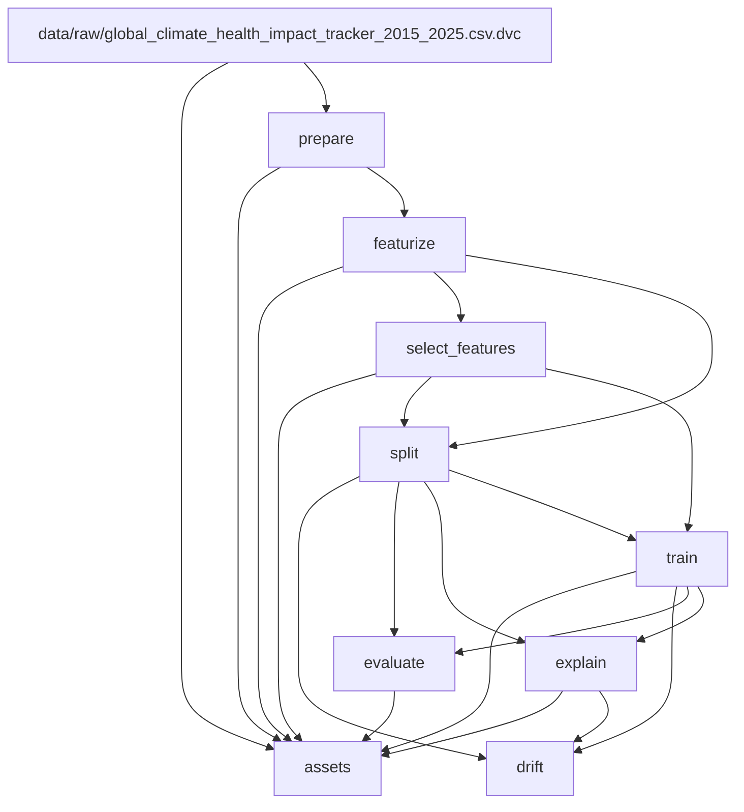

# ClimaGuard — Regional Environmental Disease-Risk Nowcast

**Team Phoenix Force:** Sayma Talukder Rupa · Md. Taohid Islam Khan Tazim · Farhan Tariq Jamee
**Course:** DS-4491 Machine Learning Systems Design (also presented in Data Analytics Laboratory), United International University, Summer 2026

ClimaGuard estimates weekly **regional** disease risk from climate, air-quality and
socioeconomic data for 25 countries (2015–2025). One classifier predicts an overall
Low / Medium / High risk class, and five regressors predict respiratory, vector-borne,
heat-related, waterborne and cardiovascular indicators. SHAP explains every
prediction, a rule engine turns them into public-health advisories, and a Flask
dashboard shows the results for Bangladesh with live Open-Meteo weather.
The whole ML workflow is a reproducible **DVC pipeline**:
`git clone` → `dvc pull` → `dvc repro` gives the same data, models and metrics.

> ⚠️ **Disclaimer.** This is a *regional environmental risk nowcast* for a population,
> built from country-level weekly data. It is **not a medical diagnosis** and must not
> be used for individual health decisions.

---

## 1. Problem & dataset

**Problem.** Climate and pollution drive several disease burdens with a lag (heat
→ admissions within days; rain + warmth → mosquitoes within weeks). Given a
country-week of environmental data, estimate how elevated each disease indicator is.

**Dataset.** `global_climate_health_impact_tracker_2015_2025.csv`
(Global Climate-Health Impact Tracker), tracked with DVC under `data/raw/`.

| Property | Value |
|---|---|
| Rows × columns | 14,100 × 30 |
| Countries / regions | 25 countries, 6 regions |
| Granularity | weekly, 564 weeks per country, 2015-01-04 → 2025-10-19 |
| Features | temperature, anomaly, precipitation, heat-wave days, drought/flood flags, extreme events, PM2.5, AQI, population, GDP, healthcare access, food security, mental-health index |
| Targets | respiratory rate, cardio mortality, vector-borne risk score, waterborne incidents, heat admissions |
| Nulls | 0 |

**Cleaning** (`prepare` stage, counts in `reports/metrics/data_quality.json`):
- 374 negative AQI values → 0.
- Healthcare access clipped to ≤ 100 (3 rows).
- Disease rates and counts, PM2.5 and precipitation clipped to ≥ 0 (none were negative).
- Drought/flood flags forced to 0/1.
- 50 duplicate country-week rows dropped (ISO week numbers repeat at some year boundaries): 14,100 → 14,050 rows.
- Rows sorted by country and date before any lag or rolling window.

**Known gaps:**
- There is no humidity, wind, UV, elevation, smoking/BMI or confirmed case count data.
- The temperature column is on the dataset's own scale, not real °C.
- The data is country-level and weekly, so there is nothing below national level or finer than a week.

## 2. ML model

| Task | Target | Candidates (4 per task) | Selection |
|---|---|---|---|
| Overall risk classifier | `risk_class` (Low/Medium/High) | Logistic Regression (elastic-net), Decision Tree, Random Forest, XGBoost | best **validation** macro-F1 |
| 5 disease regressors | one per disease | ElasticNet, Decision Tree, Random Forest, XGBoost | best **validation** RMSE |

- **Label:** `risk_class` = tertiles of a composite `health_impact_score`. The cut points use years ≤ 2023 only, and the score is never used as a feature.
- **Features:** 163 engineered predictors, all computed **inside each country**:
  - rolling mean/sum/max over 4/8/12 weeks
  - lags of 1/2/4/8 weeks
  - sin/cos of week and month
  - interactions (temperature × PM2.5, rain × temperature, PM2.5 × AQI)
  - one-hot country, region, income and climate zone
- **Feature selection:** correlation pruning (|r| > 0.95) + a committee of Pearson, mutual information and Random Forest importance. A feature needs ≥ 2 votes, then the top 60 are kept. Result: 55 features, of which 51 are used after removing targets.
- **Why tree models:**
  - Risk responds non-linearly (heat admissions jump above a temperature threshold).
  - Interactions matter (hot *and* polluted).
  - Feature scales differ by orders of magnitude.
  - SHAP's TreeExplainer is exact for trees.
  - Linear models are kept as baselines, and they win where the signal is roughly linear.
- **Why a chronological split:** lag and rolling features copy values across neighbouring weeks. A random split would put test-week information inside the training windows and inflate the scores. So:
  - train: ≤ 2022-12-31 (10,375 rows)
  - validation: 2023 (1,300 rows)
  - test: 2024-01-07 → 2025-10-19 (2,350 rows)

  The test split is never used to choose a model.

## 3. Project structure

```
ClimaGuard/
├── data/
│   ├── raw/…csv.dvc            # pointer to the raw CSV (the CSV itself is in DVC)
│   ├── interim/clean.parquet   # prepare output
│   └── processed/              # features, selected feature list, train/val/test
├── src/
│   ├── core/                   # pure logic: cleaning, features, selection, models, advisory rules
│   ├── stages/                 # one script per DVC stage (python -m src.stages.<name>)
│   └── utils/                  # paths, params.yaml loader, JSON/model IO, README table generator
├── models/                     # candidates/ (24 fitted models), best_<task>.joblib, preprocess.json
├── reports/
│   ├── metrics/                # JSON metrics tracked by Git (dvc metrics show)
│   ├── plots/                  # confusion matrix, predicted-vs-actual, drift CSVs (dvc plots show)
│   ├── shap/                   # global SHAP per model (JSON + PNG)
│   └── drift/                  # drift_report.json, per-feature PSI/KS, drift.png
├── artifacts/                  # precomputed dashboard JSON (assets stage)
├── dashboard/ templates/ static/ app.py   # Flask dashboard (reads only pipeline outputs)
├── tests/                      # pytest: API, scoring, pipeline outputs
├── params.yaml                 # every tunable value
├── dvc.yaml / dvc.lock         # pipeline definition / exact hashes of the last run
├── VIVA_NOTES.md               # viva Q&A + live demo script
└── requirements.txt
```

## 4. DVC pipeline

| Stage | Script | Main deps | Outputs |
|---|---|---|---|
| prepare | `src/stages/prepare.py` | raw CSV | `data/interim/clean.parquet`, `data_quality.json` |
| featurize | `src/stages/featurize.py` | clean.parquet | `data/processed/features.parquet`, `featurize.json` |
| select_features | `src/stages/select_features.py` | features.parquet | `selected_features.json`, `feature_rankings.csv`, `feature_selection.json` |
| split | `src/stages/split.py` | features + selection | `train/val/test.parquet`, `split_summary.json` |
| train | `src/stages/train.py` | train, val | `models/candidates/`, `models/best_*.joblib`, `preprocess.json`, `validation_metrics.json` |
| evaluate | `src/stages/evaluate.py` | models, test | `classifier_metrics.json`, `regressor_metrics.json`, `model_comparison.csv`, plots |
| explain | `src/stages/explain.py` | winners, test | `reports/shap/` |
| drift | `src/stages/drift.py` | splits, winners, SHAP | `drift_report.json`, `feature_drift.csv`, `drift_quarterly.csv` |
| assets | `src/stages/assets.py` | data, models, reports | `artifacts/*.json` (dashboard) |

`dvc dag --md` output (DVC draws this from the deps/outs in `dvc.yaml`):

<!-- DAG:START -->

<!-- DAG:END -->

**`params.yaml`.** Every setting a stage uses lives here. DVC records each stage's params in `dvc.lock`, so changing one reruns only the stages that use it.

| Section | What it controls | Used by |
|---|---|---|
| `seed` | random state for every model, the MI subsample and the SHAP sample | select_features, train, explain, assets |
| `prepare` | which columns are clipped / forced binary, the dedup key | prepare |
| `featurize` | rolling windows `[4, 8, 12]`, lags `[1, 2, 4, 8]`, interactions, dummies | featurize |
| `label` | tertile cut year and the composite score's columns | featurize |
| `select` | `corr_threshold` 0.95, `min_votes` 2, `top_k` 60, MI sample, RF trees | select_features |
| `split` | `train_end` 2022-12-31, `val_end` 2023-12-31 | split, train, assets |
| `train` | hyperparameters of all 4 model families | train |
| `explain` | SHAP `sample_size` (200) and plot size | explain |
| `drift` | PSI / KS thresholds, tolerances, which tasks to check | drift |
| `advisory` | quantile thresholds for the advisory rules | dashboard |
| `assets` | sample sizes for the dashboard charts | assets |

## 5. How to run

```bash
git clone https://github.com/taohidislamkhan/ClimaGuard.git
cd ClimaGuard
python -m venv venv
venv\Scripts\activate                 # Linux / macOS: source venv/bin/activate
pip install -r requirements.txt

# DVC remote credentials (once; stored in the git-ignored .dvc/config.local)
dvc remote modify --local origin auth basic
dvc remote modify --local origin user <your-dagshub-username>
dvc remote modify --local origin password <your-dagshub-token>

dvc pull          # raw data, models and all outputs for this commit
dvc repro         # "Data and pipelines are up to date." — or rebuilds what changed
python app.py     # dashboard at http://127.0.0.1:5000
python -m pytest -q
```

Without remote access, place the raw CSV at `data/raw/` and run `dvc repro`. The full run takes about 7 minutes on a 4-core laptop. `train` (~4 min) and `explain` (~2 min) are the slow stages.

**Change a parameter and rerun:**
```bash
# e.g. params.yaml → train.rf.n_estimators: 100
dvc status          # lists the stages whose params/deps changed
dvc repro           # reruns train → evaluate, explain, drift, assets; skips the data stages
dvc params diff
dvc metrics diff    # compare with the last commit
dvc plots show      # confusion matrix, predicted vs actual, drift (dvc_plots/index.html)
```
After a change that should be kept, commit `params.yaml`, `dvc.lock` and `reports/metrics/`, run `dvc push`, then update the tables below with `python -m src.utils.readme_tables`.

## 6. Results

The tables below are generated from `reports/metrics/*.json` by
`python -m src.utils.readme_tables`, and a test fails if they drift out of sync.

<!-- RESULTS:START -->
**Overall risk classifier** (Low / Medium / High), test split 2024-01-07 → 2025-10-19:

| Model | Accuracy | Macro-F1 | ROC-AUC (OvR, weighted) |
|---|---|---|---|
| Logistic Regression ★ selected | 0.820 | 0.819 | 0.944 |
| Random Forest | 0.809 | 0.809 | 0.938 |
| XGBoost | 0.806 | 0.805 | 0.936 |
| Decision Tree | 0.785 | 0.783 | 0.907 |

**Disease regressors** (validation winner per disease), test split:

| Disease | Model | R² | MAE | RMSE | Random Forest R² |
|---|---|---|---|---|---|
| Respiratory | Random Forest | 0.559 | 8.12 | 10.17 | 0.559 |
| Vector-borne | Random Forest | 0.916 | 3.42 | 5.11 | 0.916 |
| Heat-related | XGBoost | 0.832 | 2.58 | 4.02 | 0.803 |
| Waterborne | Random Forest | 0.626 | 3.10 | 3.99 | 0.626 |
| Cardiovascular | ElasticNet | -0.008 | 4.47 | 5.63 | -0.017 |

**Top SHAP features** (mean |SHAP| of the saved winner on test weeks):

- **overall_classifier** (Logistic Regression): `temperature_celsius`, `pm25_ugm3`, `temp_x_pm25`
- **respiratory** (Random Forest): `pm25_ugm3`, `pm25_x_aqi`, `pm25_ugm3_lag8w`
- **cardio** (ElasticNet): `heat_wave_days`, `temperature_celsius`, `temp_x_pm25`
- **vector** (Random Forest): `temperature_celsius`, `rain_x_temp`, `waterborne_disease_incidents_lag8w`
- **waterborne** (Random Forest): `waterborne_disease_incidents_roll_mean_4w`, `waterborne_disease_incidents_lag2w`, `waterborne_disease_incidents_lag1w`
- **heat** (XGBoost): `week_sin`, `temperature_celsius`, `heat_wave_days`

**Drift** (train 2015–2022 vs test 2024–2025):

- Data drift: 1 of 51 features drifted; 0 of the top 15 SHAP features. Largest PSI: `gdp_per_capita_usd` = 0.257.
- Concept drift: 0 of 40 task-quarters worse than the same quarter of 2023 beyond tolerance.
- `retrain_recommended`: **false**
<!-- RESULTS:END -->

**How these relate to earlier numbers.**
- *Proposal numbers.* The project proposal quoted preliminary figures (RF accuracy 0.617, F1 0.615, ROC-AUC 0.799; R² vector 0.909, heat 0.844, respiratory 0.555, waterborne 0.373, cardio 0.118). Those were produced before the final feature pipeline and are not what the final code outputs.
- *Pre-DVC pipeline.* The refactored DVC pipeline reproduces that pipeline's results:
  - The six selected models are within ±0.002 of the pre-DVC run (e.g. classifier accuracy 0.820 vs 0.8196).
  - Every other model is within ±0.014.
- *Why the numbers moved slightly.* The old scripts passed data between steps as CSV. Pandas' default CSV float parser changes about 86,000 values in the last binary digit, and that was enough to give one borderline feature (`precipitation_mm_lag2w`) a second vote. The pipeline now uses Parquet, which stores exact values, so the committee has 55 features instead of 54.

**Key SHAP findings.**
- Temperature and PM2.5 (and their product) dominate the overall risk class.
- PM2.5 and PM2.5 × AQI drive respiratory risk.
- Temperature and rain × temperature drive vector-borne risk.
- Season (week of year), temperature and heat-wave days drive heat admissions.
- Cardiovascular mortality is not predictable from climate here (test R² ≈ 0). The dashboard labels it low-reliability, and the advisory engine has no cardio rule.

**Drift (bonus).** The `drift` stage compares the training years with 2024–25 in two ways:
- *Data drift:* PSI + KS test on every model feature.
- *Concept drift:* each test quarter against the same quarter of 2023.

If drift is significant, `drift_report.json` sets `retrain_recommended: true`. The response is to move `split.train_end` / `split.val_end` forward and run `dvc repro`. Only GDP per capita drifted, which is a steady economic trend and not a top model feature. No quarter degraded beyond tolerance, so retraining is not needed. We still demonstrated the retrain path (§7 of VIVA_NOTES).

## 7. Limitations and future work

- **Waterborne leakage.** The rolling features of `waterborne_disease_incidents` include the current week, so the waterborne regressor partly sees its own target. Its R² (~0.63) is optimistic. We kept it so the original results stay reproducible. The fix is to shift those windows by one week.
- **Label cut year.** The risk-class tertiles are cut on years ≤ 2023, which includes the validation year. It does not touch the test years.
- **Cardiovascular** has no predictive skill from these features.
- **Coarse data:** country-level, weekly, no humidity/UV/elevation, and the temperature is on a dataset scale. The Bangladesh division map only varies local weather.
- **Frozen autoregressive inputs:** past disease counts stop at the dataset's last week, so live predictions reuse them.
- **Future work:**
  - fix the waterborne windows
  - add humidity and real case counts
  - calibrate the classifier's probabilities
  - schedule the drift stage on new weekly data
  - add a CI job that runs `dvc repro --dry` and the tests

## 8. Dashboard

`python app.py` → http://127.0.0.1:5000. The dashboard only reads pipeline outputs (`models/best_*.joblib`, `data/processed/features.parquet`, `artifacts/`, `reports/`). It never trains.

| Dashboard | My Risk |
|---|---|
|  |  |
| **Risk Map** | **How It Works (incl. Model Health / Drift)** |
|  |  |

More screenshots: [`docs/screenshots/`](docs/screenshots/).
